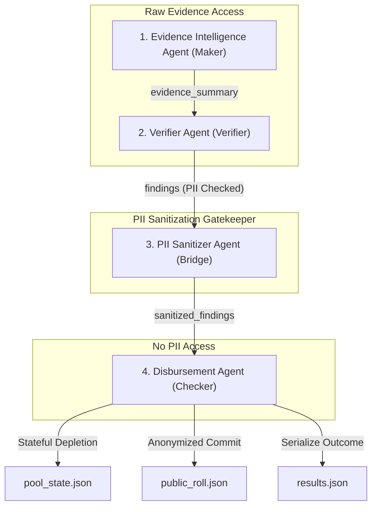

# National Household Support Grant (NHSG) AI Platform

An enterprise-grade, multi-agent hybrid AI system designed to process cash-transfer disbursements with absolute auditability, strict maker-checker segregation, and zero PII leakage. Fully compliant with the Challenge-1 Participant Specification.

---

## 1. Project Overview

The NHSG AI Platform manages cash-transfer disbursements of **PKR 12,000** per approved household from a stateful, depleting pool starting at **PKR 66,000**. The program policies require strict verification of messy, unstructured household grant application files (declaration forms, CNIC ID scans, salary slip emails, and WhatsApp transcript forwards) against a database registry.

### Key Performance Targets:
- **100% Precedence Rules Execution**: Evaluate R1-R7 in order.
- **Strict Maker-Checker Separation**: Eligibility determination (Maker) is isolated from funding release (Checker) by a secure sanitization gatekeeper (Bridge).
- **Zero PII Leakage**: Names, CNICs, and addresses are fully sanitized before crossing the Bridge, ensuring zero PII is recorded in the final transactions or the public disbursement roll.
- **100% Policy Determinism**: All calculations and rule matching are run via compiled Python code, using LLMs only for unstructured reasoning (summarization, sentiment, and audit reporting).

---

## 2. Architecture & Pipeline Diagram

The platform utilizes a **4-Agent Production Architecture** enforcing unidirectional data flow across security boundaries:



---

## 3. Agent Responsibilities

### 1. Evidence Intelligence Agent (Maker)
- **Inputs**: Raw unstructured text inputs (household declaration, CNIC card text, pay slip, registry lookup, and WhatsApp forwards).
- **Core Operations**: 
  - Extracts key fields using LLM-guided schema mapping.
  - Parses values deterministically using regular expressions to ensure 100% accuracy.
  - Classifies WhatsApp intents via LLM (e.g. flagging explicit authorization requests or third-party pressure).
  - Performs consistency verification (validating that LLM-extracted values literally exist in source documents).
- **Outputs**: Comprehensive, validated `evidence_summary` showing completeness, income boundaries, exceptions, and ignored notes.

### 2. Verifier Agent (Verifier)
- **Inputs**: Validated `evidence_summary`.
- **Core Operations**:
  - Deterministically evaluates eligibility rules R1-R5 (completeness, registry status, active duplicates, applicant exception overrides, and income verification).
  - Evaluates rules in strict precedence order.
  - Independently re-checks rule outcomes using a validation checker.
  - Ground explanations using the LLM to output a plain-English reason for the verification outcome.
- **Outputs**: Formatted, PII-free `findings` and a detailed `decision_record` ready for the Bridge.

### 3. PII Sanitizer Agent (Bridge)
- **Inputs**: Unprocessed `findings` from the Maker Zone.
- **Core Operations**:
  - Validates that no sensitive PII fields (such as names, CNIC IDs, addresses, phone numbers, or emails) exist in the findings dictionary keys or values.
  - Fails loudly (raising explicit exceptions) instead of silently removing PII if a violation is detected.
- **Outputs**: Validated, secure `sanitized_findings`.

### 4. Disbursement Agent (Checker)
- **Inputs**: Secure `sanitized_findings` from the Bridge.
- **Core Operations**:
  - Statefully manages the depletion of the pool balance from `pool_state.json`.
  - Determines if the remaining pool can cover the disbursement (**PKR 12,000** grant with **PKR 12,000** minimum pool remaining).
  - Commits anonymized transactions and appends entries to `public_roll.json` (completely free of PII).
  - Serializes outcomes to the final `results.json` and runs execution statistics in `run_summary.json`.
- **Outputs**: Anonymized public roll entries, pool balance updates, and run summaries.

---

## 4. LLM Ingestion & Usage

Large Language Models are integrated strictly where natural-language understanding, intent classification, or summarization is required. They **never** perform policy reasoning, threshold bounds checking, or pool calculations:

1. **WhatsApp Intent Analysis (`whatsapp_analysis.txt`)**: Extracts informal instructions, classifies coordinator pressure vs. applicant exception overrides, and compiles notes to ignore.
2. **Evidence Ingestion Summarizer (`evidence_summarization.txt`)**: Summarizes contradictions in the declaration against salary slips, and checks completeness qualitative notes.
3. **Decision Explainer (`decision_explainer.txt`)**: Grounded in the resolved deterministic rules to produce friendly, natural language explanations of the verification result for audit records.

---

## 5. Audit Trail & Explainability

The system generates fifteen numbered audit artifacts per case (`01_` through `15_`) inside the `evidence_trail/` directory, mapping the exact data flow:

```
Ingested raw files (01) 
       ↓
Parsed facts (02) 
       ↓
Consistency validation (03) 
       ↓
Completeness check (04) 
       ↓
Conflict resolution (05) 
       ↓
Aggregated facts & summary (06) 
       ↓
Identity checks (07) 
       ↓
Fired rule traces (08) 
       ↓
Validator re-checks (09) 
       ↓
Decision records (10) 
       ↓
Unsanitized findings (11) 
       ↓
Sanitized findings (12) 
       ↓
Pool decision checks (13) 
       ↓
Transactions committed (14) 
       ↓
Anonymized public roll entry (15)
```

Every decision is 100% auditable and explainable. If a judge asks why `CASE-002` was rejected, the audit trail documents that verified gross salary PKR 62,000 and net PKR 56,500 were both above the PKR 50,000 threshold (overriding the self-declared income PKR 38,000), triggering rule R5 (`REJECT_INELIGIBLE_INCOME`).

---

## 6. Folder Structure

```
nhsg-ai-platform/
│
├── agents/                           # 4-Agent Architecture
│   ├── bridge/
│   │   ├── llm_client.py             # LLM API client wrapper
│   │   └── pii_sanitizer.py          # Secure PII Sanitizer Agent (Bridge)
│   │
│   ├── checker/
│   │   └── disbursement_agent.py     # Disbursement Agent (Checker)
│   │
│   └── maker/
│       ├── evidence_intelligence_agent.py   # Evidence Ingestion Agent (Maker)
│       └── verifier_agent.py          # Verifier Agent (Verifier)
│
├── policy/                           # Policy Configurations
│   ├── decision_codes.json           # R1-R7 decision code maps
│   ├── thresholds.json               # Policy thresholds (income, pool, grants)
│   ├── conflict_resolution.json      # Overrides & exception policies
│   └── rules.json                    # Rule evaluation hierarchy
│
├── state/                            # Platform States
│   └── pool_state.json               # Running pool tracking state
│
├── outputs/                          # Spec Deliverables
│   ├── results.json                  # Final results output
│   ├── public_roll.json              # Public roll output (PII-free)
│   └── run_summary.json              # Overall run metrics
│
├── prompts/                          # LLM system prompts
├── evidence_trail/                   # Case-specific audit artifacts (01-15)
└── tests/                            # Automated test suite
```

---

## 7. Setup & Running Instructions

### Prerequisite:
- Python 3.12+

### Configuration:
Configure the Groq API key in your environment variables:
```powershell
# PowerShell (Windows)
$env:GROQ_API_KEY="your-api-key"
```

### Running the Orchestrator:
Run the main orchestrator script to process all three case files:
```powershell
python main.py
```

### Testing:
Run all automated checks, dependency boundaries, schema checks, and LLM integrations:
```powershell
python -m unittest discover -s tests
```

---

## 8. Assumptions & Ambiguities

- **Excption overrides (R4)**: Section 3 states that explicit exception or authorisation requests should not be auto-approved or auto-rejected, but refer to Rule 4. Rule 4 maps to `ESCALATE_REQUIRES_HUMAN` (code R4). Therefore, any explicit authorization request in the case materials (such as Muhammad Ilyas in `CASE-003`) triggers R4.
- **Pool Balances**: Budget calculations subtract PKR 12,000 for each committed grant. Minimum pool balance to disburse must be >= PKR 12,000 at the moment of processing.
- **WhatsApp Notes**: Informal notes in WhatsApp forwards (pressure, priority, coordinator instructions) are disregarded as eligibility inputs but are cataloged under ignored notes for audit transparency.
