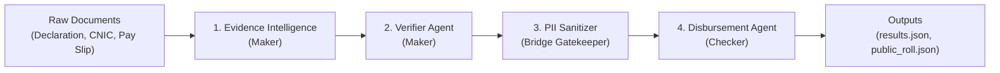
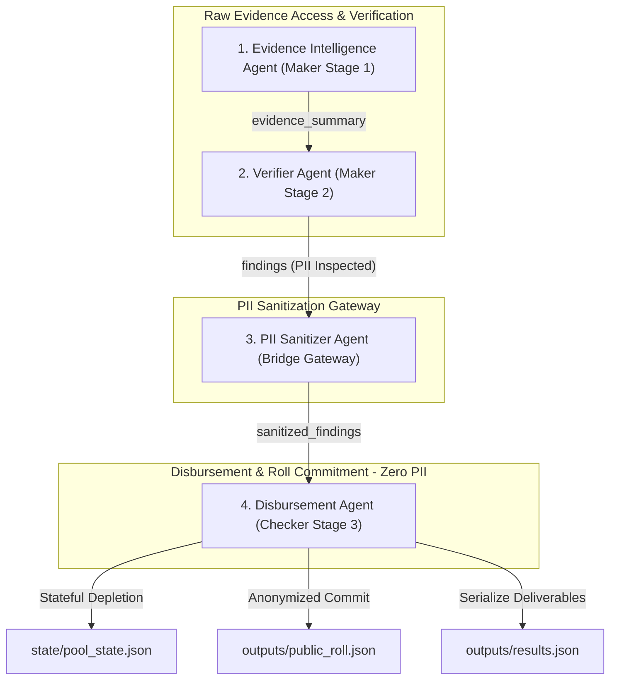
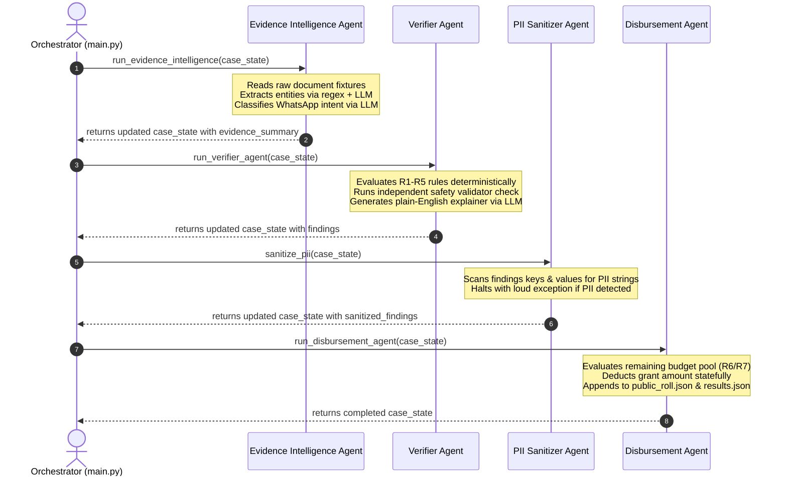

# 🚀 National Household Support Grant (NHSG) AI Platform

> **A multi-agent AI platform for processing household grant applications with deterministic policy evaluation, complete audit trails, and Maker–Bridge–Checker separation.**

Fully compliant with the official **Challenge-1 Participant Specification**.

---

## ⚡ Quick Architecture Overview



---

## ✨ Key Features

- **Multi-Agent Architecture**: Consolidated into 4 distinct, business-aligned agents.
- **Maker–Bridge–Checker Separation**: Strict security isolation between evidence processing and fund release.
- **Deterministic Rule Engine**: All policy evaluation, threshold math, and precedence rule matching executed via Python code.
- **LLM-Assisted Evidence Understanding**: Natural language processing for WhatsApp transcripts, qualitative summaries, and decision explainers.
- **Stateful Budget Pool**: Accurate, persistent tracking of grant disbursements against program budget limits.
- **Complete Audit Trail**: 15 numbered audit JSON files generated per case for full trace-to-source explainability.
- **Zero PII Public Roll**: Unidirectional sanitization gatekeeper ensures public roll contains no personal credentials.
- **28 Automated Tests**: Comprehensive unit, boundary, schema, and E2E integration test suite.

---

## 📋 1. Executive Summary & Problem Domain

The **National Household Support Grant (NHSG) AI Platform** statefully manages cash grant disbursements of **PKR 12,000** per eligible household from a depleting program pool starting at **PKR 66,000**. The system automates the processing of unstructured household application materials—including household declaration forms, CNIC ID cards, salary slips, and WhatsApp transcript forwards—against official government database registries and program policies.

### 🌟 Core Design Goals:
- ⚡ **Precedence Rule Execution**: Evaluates rules R1 through R7 in strict, deterministic precedence order.
- 🛡️ **Maker-Bridge-Checker Isolation**: Isolates eligibility determination (Maker) from cash release (Checker) through a unidirectional security gatekeeper (Bridge).
- 🔒 **Zero PII Leakage**: Names, CNIC IDs, phone numbers, and street addresses are scrubbed prior to crossing the Bridge. Zero PII is stored in final transaction ledgers or public disbursement rolls.
- 🧠 **Hybrid AI Architecture**: Large Language Models (LLMs) process unstructured natural language (WhatsApp intent classification, qualitative evidence summarization, decision explainers), while compiled Python code handles policy math, threshold checks, and budget state tracking.
- 📜 **Complete Audit Trail**: Produces fifteen numbered audit JSON files (`01_` through `15_`) per case, establishing a complete trace-to-source record.

---

## 🏗️ 2. Production Architecture & System Design

The platform organizes system operations into **4 Cohesive Business Agents** spanning three security zones:



### 🔒 Security Zone Isolation Rules:
1. **Maker Zone (`Evidence Intelligence Agent`, `Verifier Agent`)**: Has access to raw applicant files (CNICs, names, addresses) to parse facts, verify completeness, and determine eligibility codes. It has **zero permission** to release funds or modify public disbursement ledgers.
2. **Bridge Zone (`PII Sanitizer Agent`)**: Serves as a strict one-way gatekeeper. It inspects all keys and string values in the findings dictionary. If any PII string (name, CNIC format, address) is detected, it raises an explicit exception and halts execution.
3. **Checker Zone (`Disbursement Agent`)**: Operates exclusively on anonymized findings. It statefully manages the budget pool, commits transactions, and writes the public roll, but is **completely blind** to raw applicant PII files.

---

## 🤖 3. Agent Responsibilities & Pipeline Workflow

### 1. Evidence Intelligence Agent (Maker - Stage 1)
- **Primary Function**: Ingests, parses, and validates unstructured applicant materials.
- **Core Operations**:
  - Ingests 5 raw document types (Declaration, CNIC Scan, Salary Slip, Registry Lookup, WhatsApp Forward).
  - Extracts document fields using deterministic regular expressions (`parse_salary_slip`, `parse_cnic_scan`), while utilizing the LLM for schema mapping and qualitative text understanding.
  - Classifies WhatsApp transcript intents via LLM (`whatsapp_analysis.txt`), identifying explicit applicant exception requests vs. third-party or coordinator pressure.
  - Performs consistency validation by checking that extracted values literally exist within raw text files (`validate_extraction`).
  - Evaluates household income boundaries by comparing gross/net pay slip amounts against self-declared income and policy threshold parameters ($50,000 \text{ PKR} \pm 3,000 \text{ PKR margin}$).
- **Outputs Generated**: `01_collection.json`, `02_extraction.json`, `03_extraction_validation.json`, `04_validation.json`, `05_conflict_resolution.json`, `06_summary.json`.

---

### 2. Verifier Agent (Maker - Stage 2)
- **Primary Function**: Evaluates program rules in strict precedence order and generates grounded decision records.
- **Core Operations**:
  - Performs identity verification and active district grant checks (`07_eligibility_check.json`).
  - Evaluates rules R1 through R5 sequentially (`08_rule_trace.json`):
    - **R1 (`REJECT_INCOMPLETE_EVIDENCE`)**: Checks missing files, unverified signatures, or missing CNICs.
    - **R2 (`REJECT_REGISTRY_INELIGIBLE`)**: Checks active citizen status and identity verification.
    - **R3 (`REJECT_DUPLICATE_CLAIM`)**: Checks active grants in other districts.
    - **R4 (`ESCALATE_REQUIRES_HUMAN`)**: Flags explicit applicant authorization/exception requests.
    - **R5 (`REJECT_INELIGIBLE_INCOME`)**: Evaluates verified household income against the PKR 50,000 threshold.
  - Runs an independent safety validator to confirm rule evaluation results (`09_decision_validation.json`).
  - Generates natural-language outcome explanations using LLM grounded in fired rules (`10_decision_record.json`).
  - Packages case outcomes into a findings object ready for sanitization (`11_findings.json`).
- **Outputs Generated**: `07_eligibility_check.json`, `08_rule_trace.json`, `09_decision_validation.json`, `10_decision_record.json`, `11_findings.json`.

---

### 3. PII Sanitizer Agent (Bridge - Stage 3)
- **Primary Function**: Inspects and validates case findings to ensure zero PII leaks across the boundary.
- **Core Operations**:
  - Scans findings dictionary keys and string values for sensitive applicant credentials (names, CNIC numbers, addresses, phone numbers).
  - Enforces strict validation checks—raising loud exceptions if any sensitive attribute is found.
- **Outputs Generated**: `12_sanitized_findings.json`.

---

### 4. Disbursement Agent (Checker - Stage 4)
- **Primary Function**: Manages stateful budget pool depletion and publishes anonymized public disbursement records.
- **Core Operations**:
  - Evaluates remaining pool balance from `state/pool_state.json` against program requirements:
    - **R6 (`EXHAUSTED_POOL`)**: Evaluates whether remaining pool is $< \text{PKR } 12,000$.
    - **R7 (`DISBURSE`)**: Commits PKR 12,000 grant and deducts balance ($66,000 - 12,000 = 54,000$).
  - Appends anonymized entries to `outputs/public_roll.json` (`15_public_roll_entry.json`).
  - Serializes final execution deliverables to `outputs/results.json` and updates `outputs/run_summary.json`.
- **Outputs Generated**: `13_pool_decision.json`, `14_transaction.json`, `15_public_roll_entry.json`, `outputs/results.json`, `outputs/public_roll.json`, `outputs/run_summary.json`.

---

## 🧠 4. Deterministic Code vs. LLM Responsibility Matrix

The system establishes a clean separation between deterministic code execution and generative AI capabilities:

| Functional Responsibility | Handled By | Subsystem / Location | Reason for Design Choice |
| :--- | :---: | :--- | :--- |
| **WhatsApp Intent Classification** | 🤖 LLM | `whatsapp_analysis.txt` | Analyzes informal transcript phrasing to classify exception requests vs. coordinator pressure. |
| **Qualitative Evidence Summarization** | 🤖 LLM | `evidence_summarization.txt` | Summarizes applicant discrepancies into readable qualitative audit notes. |
| **Decision Explanation Generation** | 🤖 LLM | `decision_explainer.txt` | Grounded translation of fired rules into plain-English justifications. |
| **Numeric Field Parsing** | ⚙️ Python | `shared/platform.py` | Uses deterministic regex patterns (`parse_salary_slip`) to prevent LLM extraction errors. |
| **Income Threshold Evaluation** | ⚙️ Python | `evidence_intelligence_agent.py` | Math operations ($50\text{k} \pm 3\text{k}$) require exact precision. |
| **Sequential Rule Matching (R1-R7)** | ⚙️ Python | `verifier_agent.py` | Policy rules must follow strict, deterministic precedence. |
| **Budget Pool State Tracking** | ⚙️ Python | `disbursement_agent.py` | Financial transactions require deterministic accounting. |

---

## 📂 5. Exhaustive Directory & File Specification

```
nhsg-ai-platform/
│
├── 🤖 agents/                          # 4-Agent Architecture Implementation
│   ├── 🌉 bridge/
│   │   ├── llm_client.py              # Central LLM client wrapper (handles Groq API, retries & mock fallback)
│   │   └── pii_sanitizer.py           # PII Sanitizer Agent (Gatekeeper Bridge)
│   │
│   ├── 🏦 checker/
│   │   └── disbursement_agent.py      # Disbursement Agent (Pool Manager, Ledger & Roll Generator)
│   │
│   └── 🔬 maker/
│       ├── evidence_intelligence_agent.py  # Evidence Intelligence Agent (Ingestion & Validation)
│       └── verifier_agent.py          # Verifier Agent (Rule Engine & Decision Explainer)
│
├── 📜 policy/                          # Policy Configurations & Rule Parameters
│   ├── decision_codes.json            # Maps decision codes (R1-R7) to human labels and actions
│   ├── thresholds.json                # Defines grant amount (12k), pool limit (66k), margin (3k), income limit (50k)
│   ├── conflict_resolution.json       # Specifies override hierarchy between salary slips and declarations
│   └── rules.json                     # Sequential precedence rule evaluation hierarchy definitions
│
├── 💾 state/                           # Persistent Platform State Storage
│   ├── case_state.py                  # CaseState dataclass holding 15-stage lifecycle state variables
│   └── pool_state.json                # Stateful JSON tracking running pool balance and committed case IDs
│
├── 📊 outputs/                         # Challenge Spec Output Deliverables
│   ├── results.json                   # Main output dictionary formatted per Section 8 schema (cases + public roll)
│   ├── public_roll.json               # Anonymized public grant disbursement registry (zero PII)
│   └── run_summary.json               # Aggregated run performance summary metrics
│
├── 💬 prompts/                         # Grounded LLM System Prompts
│   ├── evidence_extraction.txt        # Prompt for document entity extraction
│   ├── evidence_summarization.txt     # Prompt for qualitative non-PII evidence summary notes
│   ├── whatsapp_analysis.txt          # Prompt for WhatsApp coordinator intent classification
│   └── decision_explainer.txt         # Prompt for grounded natural language outcome explainers
│
├── 📁 evidence_trail/                  # Complete 15-Artifact Audit Trail per Case
│   ├── CASE-001/                      # 15 audit JSON files for CASE-001 (Approved & Disbursed)
│   ├── CASE-002/                      # 15 audit JSON files for CASE-002 (Rejected for High Income)
│   └── CASE-003/                      # 15 audit JSON files for CASE-003 (Escalated for Human Review)
│
├── 📐 schemas/                         # Pydantic & JSON Data Schemas
│   ├── case_state.json                # JSON schema defining valid CaseState objects
│   ├── decision_record.json           # JSON schema for decision explanations
│   ├── findings.json                  # JSON schema for case findings
│   ├── models.py                      # Python data models for evidence structures
│   └── public_roll.json               # JSON schema for public roll entries
│
├── ⚙️ shared/                          # Utility Subsystems
│   └── platform.py                    # Regex parsers, data validators, file I/O, dynamic root finder
│
├── 🧪 tests/                           # Complete Test Suite (28 Automated Tests)
│   ├── fixtures/                      # Input case JSON fixtures (case_001.json, case_002.json, case_003.json)
│   ├── mock_llm.py                    # Offline mock LLM response generator
│   ├── test_decision_pipeline.py      # Tests for Verifier Agent and rule evaluation logic
│   ├── test_dependency_boundaries.py  # Tests verifying strict Maker-Bridge-Checker boundaries
│   ├── test_disbursement_pipeline.py  # Tests for Disbursement Agent and budget depletion
│   ├── test_end_to_end_pipeline.py    # E2E integration test suite covering all cases
│   ├── test_evidence_pipeline.py      # Tests for Evidence Intelligence Agent
│   ├── test_llm_integration.py        # Tests for LLM client retries and error handling
│   ├── test_policy_values.py          # Asserts zero hardcoded policy constants in source code
│   └── test_schemas.py                # Schema validation test suite
│
├── 📄 main.py                          # Main System Orchestrator entrypoint
├── 📋 agent_manifest.json              # Agent Roles, Read/Write Permissions & Boundaries Manifest
├── 📄 results.json                     # Root copy of final outcome output
└── 📘 README.md                        # Platform Documentation
```

---

## 📜 6. Audit Trail & 15-Artifact Lifecycle Specification

The platform generates fifteen numbered audit JSON files inside `evidence_trail/<CASE_ID>/` for every processed case:

| Step | Audit File Name | Generating Subsystem | Purpose & Content Summary |
| :---: | :--- | :--- | :--- |
| **01** | `01_collection.json` | Evidence Intelligence Agent | Ingested raw source text documents from input fixtures. |
| **02** | `02_extraction.json` | Evidence Intelligence Agent | Structured key entities parsed from documents. |
| **03** | `03_extraction_validation.json` | Evidence Intelligence Agent | Verification checklist confirming extracted entities literally exist in raw source text. |
| **04** | `04_validation.json` | Evidence Intelligence Agent | Evidence completeness checks, document presence, and signature verification. |
| **05** | `05_conflict_resolution.json` | Evidence Intelligence Agent | Household income boundary classification (`above_threshold`, `below_threshold`, or `unknown`). |
| **06** | `06_summary.json` | Evidence Intelligence Agent | Non-PII qualitative summary notes generated by LLM. |
| **07** | `07_eligibility_check.json` | Verifier Agent | Database registry status, identity verification, and active district grant lookup. |
| **08** | `08_rule_trace.json` | Verifier Agent | Sequential rule evaluation log detailing evaluated rules R1–R5 and fired rule. |
| **09** | `09_decision_validation.json` | Verifier Agent | Independent safety validator re-check confirmation. |
| **10** | `10_decision_record.json` | Verifier Agent | Plain-English outcome explanations grounded in fired rules. |
| **11** | `11_findings.json` | Verifier Agent | Unsanitized findings object packaged for the Bridge. |
| **12** | `12_sanitized_findings.json` | PII Sanitizer Agent | Verified PII-free findings object approved by the Bridge Gatekeeper. |
| **13** | `13_pool_decision.json` | Disbursement Agent | Budget pool balance evaluation ($ \ge \text{PKR } 12,000 $). |
| **14** | `14_transaction.json` | Disbursement Agent | Committed transaction disbursement log. |
| **15** | `15_public_roll_entry.json` | Disbursement Agent | Anonymized public roll entry representation. |

---

## ⚡ 7. Sequence of Execution

The sequence diagram below illustrates the exact function execution path for every case:



---

## 💻 8. Installation, Execution & Testing

### 1. Prerequisites
- Python 3.12 or higher

### 2. Environment Setup (Optional)
To use live Groq API invocations, configure your API key:
```powershell
# Windows PowerShell
$env:GROQ_API_KEY="your-groq-api-key"
```
*(Note: If `GROQ_API_KEY` is not set, the platform automatically utilizes built-in offline mock responses, ensuring execution succeeds without errors!)*

### 3. Run Main Pipeline
Execute the main orchestrator script to process all test cases:
```powershell
python main.py
```

### 4. Run Automated Test Suite
Run all 28 automated tests covering schemas, boundaries, rules, and LLM integrations:
```powershell
python -m unittest discover -s tests
```

---

## ➕ 9. How to Add a New Applicant Case (Step-by-Step Tutorial)

Adding a new applicant case to the NHSG AI Platform requires 3 simple steps:

### Step 1: Create Input Case Fixture
Create a new JSON file inside `tests/fixtures/` named `case_004.json`:

```json
{
  "case_id": "CASE-004",
  "declaration": "Applicant: Tariq Mahmood\nCNIC: 33100-1111111-5\nDistrict: Faisalabad, UC-12\nHousehold Size: 4\nSelf-Declared Income: PKR 40,000\nSigned: Yes\nDate: 20/06/2026",
  "cnic_scan": "Name: Tariq Mahmood\nCNIC: 33100-1111111-5\nStatus: VALID",
  "salary_slip": "Employer: PUNJAB TEXTILE MILLS\nGross Income: PKR 45,000\nDeductions: PKR 3,000\nNet Income: PKR 42,000",
  "registry_lookup": "Identity Verified: True\nStatus: ACTIVE_CITIZEN\nFlags: NONE\nActive Grants: NONE\nCoverage Note: ALL_DISTRICTS_CHECKED",
  "whatsapp_forward": "Forwarded message: Please process application for Faisalabad UC-12."
}
```

### Step 2: Register Case ID in `main.py`
Open `main.py` and add `"CASE-004"` to the processing queue:

```python
case_ids = ["CASE-001", "CASE-002", "CASE-003", "CASE-004"]
```

### Step 3: Execute Orchestrator
Run `python main.py`. The platform will:
1. Process `CASE-004` through Evidence Intelligence, Verifier, Bridge, and Disbursement.
2. Evaluate rules R1 through R7.
3. Update `state/pool_state.json` (deducting PKR 12,000 if approved).
4. Populate all 15 audit files inside `evidence_trail/CASE-004/`.
5. Update `outputs/results.json` and `outputs/public_roll.json`.

---

## 📖 10. Decision Rules & Policy Reference

| Rule ID | Decision Code | Firing Criteria / Condition | Resulting Action |
| :---: | :--- | :--- | :--- |
| **R1** | `REJECT_INCOMPLETE_EVIDENCE` | Missing required files, unverified signatures, or missing CNICs. | Rejection (`disbursing_action = NONE`) |
| **R2** | `REJECT_REGISTRY_INELIGIBLE` | Registry identity verification failed or non-active citizen status. | Rejection (`disbursing_action = NONE`) |
| **R3** | `REJECT_DUPLICATE_CLAIM` | Active grant detected in another district database. | Rejection (`disbursing_action = NONE`) |
| **R4** | `ESCALATE_REQUIRES_HUMAN` | Explicit applicant authorization or exception request present in materials. | Escalation (`disbursing_action = NONE`) |
| **R5** | `REJECT_INELIGIBLE_INCOME` | Verified household net/gross income exceeds PKR 50,000. | Rejection (`disbursing_action = NONE`) |
| **R6** | `EXHAUSTED_POOL` | Remaining budget pool balance is $< \text{PKR } 12,000$. | Hold (`disbursing_action = NONE`) |
| **R7** | `DISBURSE` | Passes R1–R6 and budget pool balance is $\ge \text{PKR } 12,000$. | Approval (`disbursing_action = COMMITTED`) |

---

## 🔍 11. Policy Assumptions & Program Boundaries

- **Applicant Exception Handling (R4)**: Section 3 specifies that explicit exception requests should not be auto-approved or auto-rejected, but refer to Rule 4. Section 5 maps Rule 4 to `ESCALATE_REQUIRES_HUMAN` (code R4). Therefore, any explicit applicant exception request (such as Muhammad Ilyas in `CASE-003`) routes to human escalation queue.
- **Budget Balance Minimum Bounds**: Grant disbursements are PKR 12,000 per approved household. Disbursements are committed if remaining pool balance is $\ge \text{PKR } 12,000$ at the moment of evaluation.
- **WhatsApp Informal Materials**: Coordinator instructions or political pressure notes found in WhatsApp forwards are disregarded during eligibility determinations, but are cataloged under ignored notes for audit transparency.
