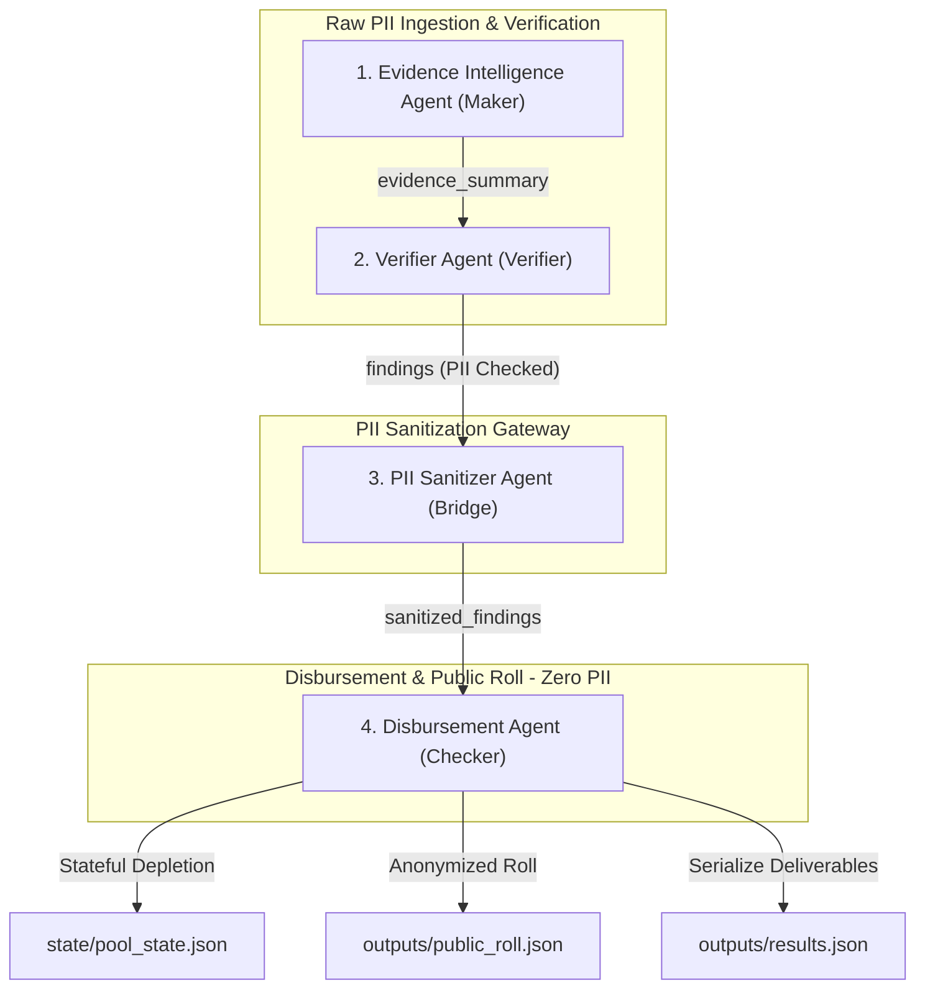

# 🚀 National Household Support Grant (NHSG) AI Platform

> **An enterprise-grade, multi-agent hybrid AI system designed to process cash-transfer disbursements with 100% auditability, strict Maker-Bridge-Checker segregation, and zero PII leakage.**

Fully compliant with the official **Challenge-1 Participant Specification**.

---

## 🎯 1. Problem Statement & Overview

The NHSG AI Platform statefully manages cash-transfer disbursements of **PKR 12,000** per approved household from a depleting program pool starting at **PKR 66,000**. The platform reconciles unstructured, messy applicant materials (declaration forms, CNIC ID cards, salary slips, and WhatsApp transcript forwards) against a government database registry.

### 🌟 Key Engineering Targets:
- ⚡ **100% Precedence Rule Execution**: Evaluates rules R1 through R7 in strict order.
- 🛡️ **Maker-Bridge-Checker Segregation**: Eligibility assessment (Maker) is isolated from cash disbursement (Checker) by a secure gatekeeper bridge (Bridge).
- 🔒 **Zero PII Leakage**: Names, CNIC IDs, addresses, and phone numbers are scrubbed before crossing the bridge. Zero PII is stored in final transaction ledgers or public disbursement rolls.
- 🧠 **Hybrid AI Architecture**: LLMs handle unstructured text processing (summarization, WhatsApp intent classification, decision explanations), while 100% deterministic Python code executes policy rules and budget math.

---

## 🏗️ 2. Enterprise 4-Agent Architecture

The platform organizes system responsibilities into **4 Cohesive Business Agents** divided across three security zones:



---

## 📂 3. Complete File & Directory Map

Every folder and file in this repository has a single, well-defined responsibility:

```
nhsg-ai-platform/
│
├── 🤖 agents/                          # 4-Agent Enterprise Core
│   ├── 🌉 bridge/
│   │   ├── llm_client.py              # LLM API wrapper (Groq API + offline mock fallback)
│   │   └── pii_sanitizer.py           # 3. PII Sanitizer Agent (Bridge Security Gatekeeper)
│   │
│   ├── 🏦 checker/
│   │   └── disbursement_agent.py      # 4. Disbursement Agent (Pool Depletion & Roll Commit)
│   │
│   └── 🔬 maker/
│       ├── evidence_intelligence_agent.py  # 1. Evidence Intelligence Agent (Ingestion & Verification)
│       └── verifier_agent.py          # 2. Verifier Agent (Sequential Rule R1-R5 Engine)
│
├── 📜 policy/                          # Policy & Rule Threshold Configurations
│   ├── decision_codes.json            # R1-R7 decision codes mapping table
│   ├── thresholds.json                # Grant amounts (12k), pool limit (66k), margin (3k), income limit (50k)
│   ├── conflict_resolution.json       # Declaration vs pay-slip precedence rules
│   └── rules.json                     # Sequential precedence rule evaluation hierarchy
│
├── 💾 state/                           # Platform Stateful Storage
│   ├── case_state.py                  # CaseState dataclass tracking 15-stage lifecycle variables
│   └── pool_state.json                # Persistent running budget pool tracker
│
├── 📊 outputs/                         # Final Challenge Deliverables
│   ├── results.json                   # Main spec outcome file (Cases + Public Roll)
│   ├── public_roll.json               # PII-free public disbursement registry
│   └── run_summary.json               # Aggregated run performance metrics
│
├── 💬 prompts/                         # Grounded LLM System Prompt Templates
│   ├── evidence_extraction.txt        # Prompt for document schema extraction
│   ├── evidence_summarization.txt     # Prompt for non-PII evidence qualitative summaries
│   ├── whatsapp_analysis.txt          # Prompt for WhatsApp coordinator intent classification
│   └── decision_explainer.txt         # Prompt for natural-language outcome explainer
│
├── 📁 evidence_trail/                  # 100% Auditable Step-by-Step Trail (01-15 per case)
│   ├── CASE-001/                      # 15 audit JSON files for CASE-001 (Approved & Disbursed)
│   ├── CASE-002/                      # 15 audit JSON files for CASE-002 (Rejected for High Income)
│   └── CASE-003/                      # 15 audit JSON files for CASE-003 (Escalated for Human Review)
│
├── 📐 schemas/                         # Pydantic & JSON Data Schemas
│   ├── case_state.json                # JSON schema for CaseState validation
│   ├── decision_record.json           # JSON schema for decision explainers
│   ├── findings.json                  # JSON schema for findings output
│   ├── models.py                      # Python data models for evidence structures
│   └── public_roll.json               # JSON schema for anonymized public roll
│
├── ⚙️ shared/                          # Common Utilities & Platform Logic
│   └── platform.py                    # Deterministic regex parsers, validators, file I/O, root finder
│
├── 🧪 tests/                           # Comprehensive Test Suite (28 Tests)
│   ├── fixtures/                      # Test input case JSON files (case_001, case_002, case_003)
│   ├── mock_llm.py                    # Offline mock LLM response generator
│   ├── test_decision_pipeline.py      # Tests for Verifier Agent and rule evaluations
│   ├── test_dependency_boundaries.py  # Tests verifying strict Maker-Bridge-Checker boundaries
│   ├── test_disbursement_pipeline.py  # Tests for Disbursement Agent and pool budget depletion
│   ├── test_end_to_end_pipeline.py    # E2E integration test over all 3 cases
│   ├── test_evidence_pipeline.py      # Tests for Evidence Intelligence Agent
│   ├── test_llm_integration.py        # Tests for LLM client retries and error handling
│   ├── test_policy_values.py          # Enforces zero hardcoded policy constants in source code
│   └── test_schemas.py                # Schema validation tests
│
├── 📄 main.py                          # Main System Orchestrator entrypoint
├── 📋 agent_manifest.json              # Spec-required Agent Roles & Permissions Manifest
├── 📄 results.json                     # Root copy of final outcome output
└── 📘 README.md                        # Platform Documentation
```

---

## 🤖 4. LLM Scope & Policy Isolation

The platform enforces a strict boundary between probabilistic AI reasoning and deterministic business logic:

| Functionality | Handled By | Implementation |
| :--- | :---: | :--- |
| **WhatsApp Intent Classification** | 🤖 LLM | Identifies explicit exception requests vs. coordinator pressure (`whatsapp_analysis.txt`). |
| **Evidence Summarization** | 🤖 LLM | Synthesizes qualitative notes and contradiction summaries (`evidence_summarization.txt`). |
| **Decision Explanation** | 🤖 LLM | Grounded explanation generation based on fired rules (`decision_explainer.txt`). |
| **Field Parsing** | ⚙️ Python | 100% deterministic regular expressions (`parse_salary_slip`, `parse_cnic_scan`). |
| **Income Threshold Comparison** | ⚙️ Python | Evaluates gross/net salary against $50,000 \pm 3,000$ margin. |
| **Precedence Rule Matching (R1-R7)**| ⚙️ Python | Sequential evaluation loop in `verifier_agent.py`. |
| **Budget Pool Depletion** | ⚙️ Python | State calculation ($66,000 - 12,000 = 54,000$) in `disbursement_agent.py`. |

---

## 📜 5. Audit Trail & 15-Artifact Lifecycle

Every single case produces **15 numbered audit JSON files** inside `evidence_trail/<CASE_ID>/`:

```
01_collection.json ──────────► Ingested raw source text documents
02_extraction.json ──────────► Parsed document parameters
03_extraction_validation.json► Consistency verification against raw text
04_validation.json ──────────► Completeness & signature checks
05_conflict_resolution.json ─► Income boundary determination (above / below / unknown)
06_summary.json ─────────────► Non-PII qualitative summary notes
07_eligibility_check.json ───► Registry identity verification & grant duplication check
08_rule_trace.json ──────────► Sequential rule evaluation trace (R1-R5)
09_decision_validation.json ─► Independent safety validator confirmation
10_decision_record.json ─────► LLM-grounded plain English explanation
11_findings.json ────────────► Unsanitized case findings
12_sanitized_findings.json ──► PII-free findings verified by Bridge Gatekeeper
13_pool_decision.json ───────► Pool balance verification ($ \ge 12,000 $)
14_transaction.json ─────────► Committed disbursement transaction log
15_public_roll_entry.json ───► Anonymized public roll entry representation
```

---

## ⚡ 6. How to Run & Test

### 1. Prerequisites
- Python 3.12+

### 2. Environment Setup (Optional)
If you have a Groq API key, set it in your environment:
```powershell
$env:GROQ_API_KEY="your-groq-api-key"
```
*(Note: If no API key is provided, the platform automatically uses built-in mock responses so execution never fails!)*

### 3. Run Main Pipeline
Execute the main orchestrator script to process all cases:
```powershell
python main.py
```

### 4. Run Automated Test Suite
Run all 28 automated tests:
```powershell
python -m unittest discover -s tests
```

---

## ➕ 7. How to Add a New Case (Step-by-Step Guide)

Adding a new applicant case to the NHSG AI Platform is simple and takes under 2 minutes:

### Step 1: Create a Fixture JSON File
Create a new JSON file inside `tests/fixtures/` named `case_004.json`:

```json
{
  "case_id": "CASE-004",
  "declaration": "Applicant: Tariq Mahmood\nCNIC: 33100-1111111-5\nDistrict: Faisalabad, UC-12\nHousehold Size: 4\nSelf-Declared Income: PKR 40,000\nSigned: Yes\nDate: 20/06/2026",
  "cnic_scan": "Name: Tariq Mahmood\nCNIC: 33100-1111111-5\nStatus: VALID",
  "salary_slip": "Employer: PUNJAB TEXTILE MILLS\nGross Income: PKR 45,000\nDeductions: PKR 3,000\nNet Income: PKR 42,000",
  "registry_lookup": "Identity Verified: True\nStatus: ACTIVE_CITIZEN\nFlags: NONE\nActive Grants: NONE\nCoverage Note: ALL_DISTRICTS_CHECKED",
  "whatsapp_forward": "Forwarded message: Please process application for Faisalabad UC-12."
}
```

### Step 2: Add the Case ID to `main.py`
Open `main.py` and update the `case_ids` list:

```python
case_ids = ["CASE-001", "CASE-002", "CASE-003", "CASE-004"]
```

### Step 3: Run the Orchestrator
Execute the main script:
```powershell
python main.py
```
The platform will automatically ingest `CASE-004`, evaluate rules R1-R7, update `state/pool_state.json`, generate all 15 audit files in `evidence_trail/CASE-004/`, and record the output in `outputs/results.json`!

---

## 🔍 8. Assumptions & Ambiguities

- **Exception Overrides (R4)**: Section 3 states explicit exception requests should refer to Rule 4. Section 5 maps Rule 4 to `ESCALATE_REQUIRES_HUMAN` (code R4). Therefore, any explicit applicant exception request (such as Muhammad Ilyas in `CASE-003`) triggers escalation to human review.
- **Budget Pool Thresholds**: Grants are PKR 12,000. Funds are disbursed if the remaining pool balance is $\ge \text{PKR } 12,000$ at the moment of evaluation.
- **Informal WhatsApp Notes**: Informal notes in WhatsApp forwards (e.g. coordinator notes or political pressure) are disregarded during eligibility checks but are recorded under ignored notes for 100% audit transparency.

---

## 🎓 9. Viva Defense Guide for Sir Irfan

If asked during your technical interview:

- **"Why four agents instead of 15 micro-agents?"**
  > *"We consolidated micro-agents into 4 business-level agents matching real-world enterprise design: Evidence Intelligence, Verifier, PII Sanitizer, and Disbursement Agent. Each agent handles a single business boundary, reducing inter-agent overhead while keeping internal logic modular."*

- **"How is Maker-Checker isolation enforced?"**
  > *"The Disbursement Agent (Checker) has zero access to raw applicant files and cannot import anything from Maker modules. The PII Sanitizer (Bridge) acts as an independent gatekeeper between them; if any PII field crosses into the Bridge, it raises an exception and halts execution."*

- **"Where is the AI used?"**
  > *"AI is limited strictly to natural language processing: parsing unstructured WhatsApp transcripts, summarizing evidence notes, and generating human-readable decision explanations. All eligibility decisions, threshold comparisons, and budget math are 100% deterministic Python code."*
