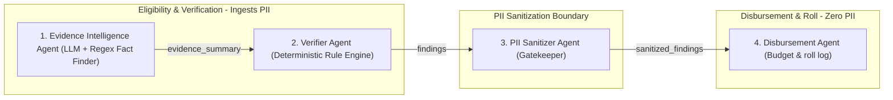
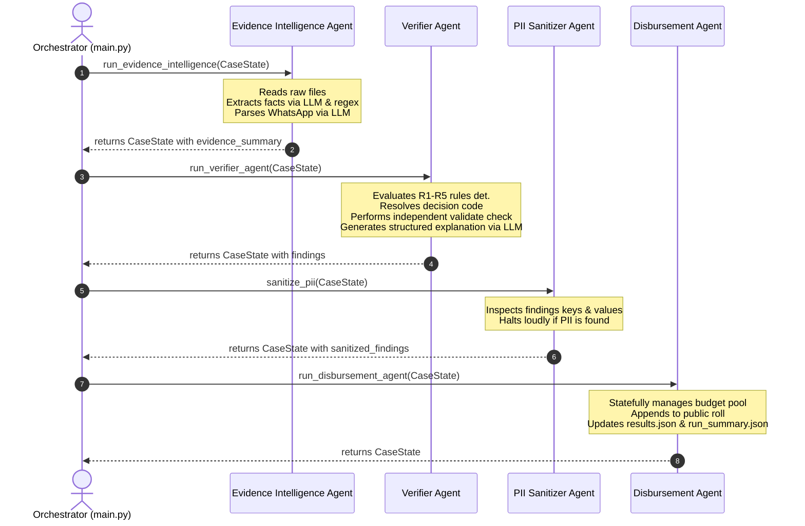

# System Architecture Document

This document defines the architecture, data flows, CaseState lifecycle, audit artifact lifecycle, security boundary rules, and design choices of the consolidated 4-agent `nhsg-ai-platform` benefit-disbursement system.

---

## 1. System Components & Zones

The platform separates responsibilities into three zones to guarantee security and prevent conflicts of interest (Maker-Checker segregation):

---

## 2. Sequence Diagram

The diagram below details the chronological processing flow of a case through the orchestrator pipeline:

---

## 3. Data Flow & CaseState Lifecycle

The system runs case operations through the state object `CaseState`. The table below outlines how state keys are populated and verified across the pipeline:

1. **Inception**: `CaseState` is initialized with a `case_id` (e.g. `CASE-001`).
2. **Collection Stage**: Ingests raw case documents from fixtures, storing them inside `CaseState.raw_evidence`.
3. **Extraction Stage**: Maps raw text to structured dictionary variables inside `CaseState.extracted_evidence` and `CaseState.det_parsed` (deterministic regex output).
4. **Validation Stage**: Compares extracted parameters against raw texts, storing results in `CaseState.extraction_validation` and `CaseState.validated_evidence`.
5. **Conflict Resolution**: Compares net/gross salary ranges against policy thresholds, storing outcomes in `CaseState.resolved_evidence`.
6. **Fact Synthesis**: The LLM synthesizes evidence parameters into a non-PII summary inside `CaseState.evidence_summary`.
7. **Eligibility Checking**: Ingests registry facts and stores verified flags in `CaseState.eligibility_check`.
8. **Rule Trace Evaluation**: Runs sequential checks against rules R1-R5 in order of precedence, storing rules evaluated in `CaseState.rule_trace`.
9. **Validator Recheck**: Validates rule evaluation against resolved decisions, writing confirmation flags to `CaseState.decision_validation`.
10. **Explanation Ingest**: Generates natural language justifications and writes them to `CaseState.decision_record`.
11. **Findings Generation**: Packages decisions, flags, and record references into `CaseState.findings`.
12. **Sanitization**: Bridge reviews findings and writes PII-free data to `CaseState.sanitized_findings`.
13. **Disbursement Release**: Checker evaluates remaining budget against grant values, updating `CaseState.pool_decision` and `CaseState.transaction`.
14. **Disbursement Commit**: If committed, Checker creates `CaseState.public_roll_entry`.

---

## 4. Audit Artifact Lifecycle

The system creates fifteen numbered audit files (`01_` through `15_`) inside the `evidence_trail/` directory, documenting every stage of the pipeline:

| Step | Artifact File | Generating Agent | Purpose |
| :--- | :--- | :--- | :--- |
| **01** | `01_collection.json` | Evidence Intelligence Agent | Ingested raw source text documents. |
| **02** | `02_extraction.json` | Evidence Intelligence Agent | Extracted key facts (decl, scan, slip, registry, wa). |
| **03** | `03_extraction_validation.json` | Evidence Intelligence Agent | Extraction consistency verification results. |
| **04** | `04_validation.json` | Evidence Intelligence Agent | Evidence completeness and CNIC match checks. |
| **05** | `05_conflict_resolution.json` | Evidence Intelligence Agent | Income boundary check and ignored notes list. |
| **06** | `06_summary.json` | Evidence Intelligence Agent | Aggregated facts and qualitative LLM summary. |
| **07** | `07_eligibility_check.json` | Verifier Agent | Identity verification and duplicate grant lookup. |
| **08** | `08_rule_trace.json` | Verifier Agent | Evaluation logs and fired rule details. |
| **09** | `09_decision_validation.json` | Verifier Agent | Safety validator confirmation trace. |
| **10** | `10_decision_record.json` | Verifier Agent | Fired rule context and LLM-grounded explanation. |
| **11** | `11_findings.json` | Verifier Agent | Packaging of clean findings for sanitization. |
| **12** | `12_sanitized_findings.json` | PII Sanitizer Agent | Filtered findings validated to contain zero PII. |
| **13** | `13_pool_decision.json` | Disbursement Agent | Balance checking and budget depletion decision. |
| **14** | `14_transaction.json` | Disbursement Agent | Committed transaction disbursement log. |
| **15** | `15_public_roll_entry.json` | Disbursement Agent | Anonymized roll entry representation. |

---

## 5. Security & Maker-Checker Model

Strict **Maker-Checker Segregation** is maintained by physical and logical isolation:
- **Maker Zone (Evidence Ingestion & Verifier)**: Allowed to inspect raw credentials (names, CNIC IDs, addresses), but has **zero** access to depletion balances or pool release actions.
- **Secure Bridge (PII Sanitizer)**: A one-way security checkpoint. It verifies that no name or ID exists in findings keys or values. It raises explicit errors and halts execution on any violation.
- **Checker Zone (Disbursement Agent)**: Operates only on sanitized inputs. It modifies pool balances statefully and writes to the final rolls, but is completely blind to raw applicant files.

---

## 6. Design Choices

### Why Four Agents?
- A professional AI architecture must avoid both "mega-agent monoliths" and "micro-agent sprawl". Keeping exactly 4 business agents ensures clean segregation, ease of maintenance, and high auditability.

### Why Use an LLM?
- Ingesting messy, unstructured files (such as OCR-extracted forms or WhatsApp forwards) is highly suited for natural language processing. The LLM acts as an assistant to interpret transcripts, summarize details, and ground explanations.

### Why Separate Deterministic Rules?
- Evaluating rules, calculating income margins, checking pool bounds, and releasing funds require absolute, mathematical precision. Delegating these to probabilistic LLMs invites hallucinations, making the platform unreliable. All policy rules are evaluated deterministically using Python code.
