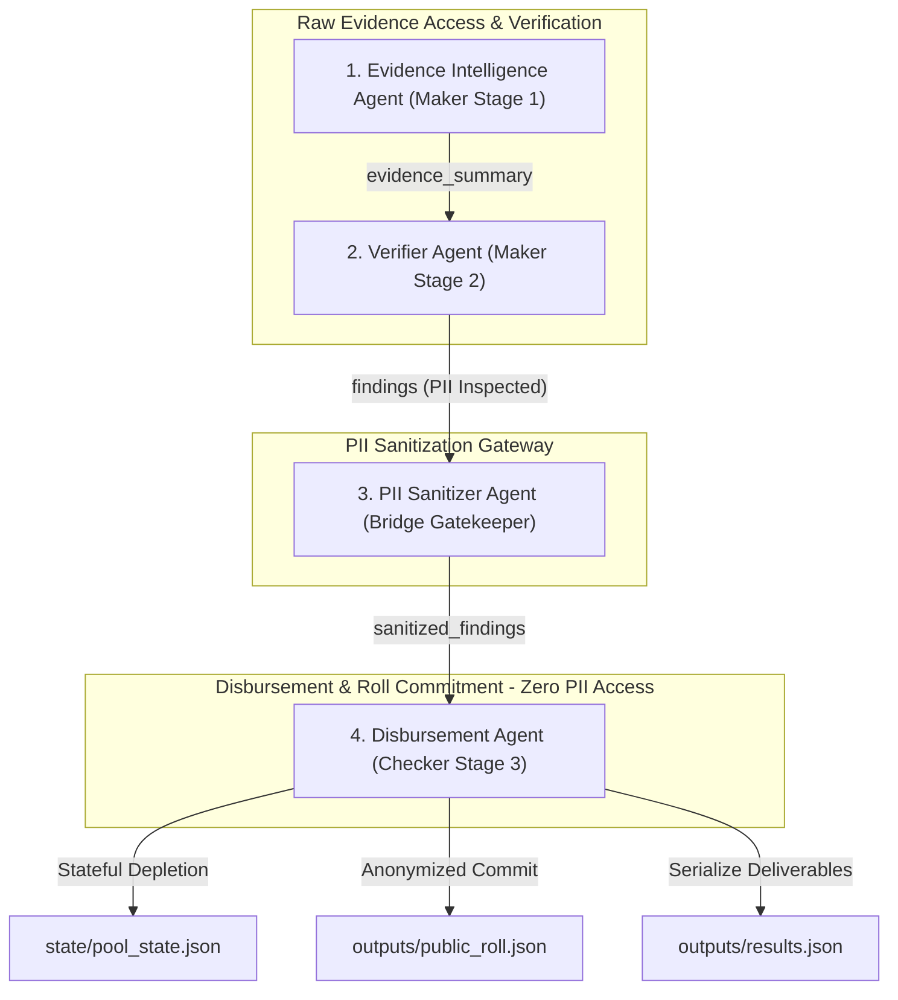
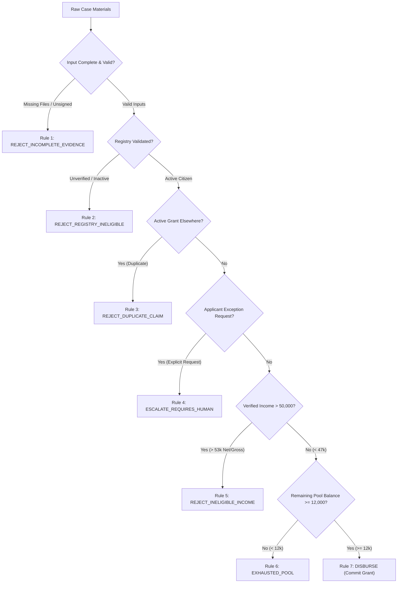

# 📑 National Household Support Grant (NHSG) AI Platform
## System Architecture, Security Design, & Verification Report

---

### 📌 Document Control & Metadata

| Metadata Field | Document Detail |
| :--- | :--- |
| **Project Title** | National Household Support Grant (NHSG) AI Platform |
| **Document Type** | System Architecture, Security Design, & Verification Report |
| **Specification Basis** | Challenge-1 Participant Specification |
| **Architecture Pattern** | 4-Agent Maker-Bridge-Checker Design |
| **Repository URL** | [https://github.com/UsmanBari/nhsg-ai-platform](https://github.com/UsmanBari/nhsg-ai-platform) |
| **Test Verification** | **Passed** (All 28 automated unit & E2E integration tests passing) |
| **PII Protection Status** | **Verified** (Maker–Bridge–Checker isolation enforced via sanitizer bridge) |
| **Document Version** | Version 2.1 (Refined Technical Edition) |
| **Date** | July 30, 2026 |

---

## 1. Executive Summary

This report documents the technical design, policy implementation, failure-mode resilience engineering, and empirical test verification of the **National Household Support Grant (NHSG) AI Platform**.

The platform is a multi-agent software system designed to statefully manage cash grant disbursements of **PKR 12,000** per eligible household from a depleting program pool starting at **PKR 66,000**. The system automates the ingestion, parsing, verification, policy evaluation, and financial release of unstructured household grant applications—including declaration forms, CNIC ID cards, salary slips, and WhatsApp transcript forwards—against official government database registries and program policies.

### 🌟 Core Highlights:
1. **Consolidated Architecture**: Implements 4 cohesive, business-aligned agents (`Evidence Intelligence Agent`, `Verifier Agent`, `PII Sanitizer Agent`, `Disbursement Agent`).
2. **Deterministic Policy Engine**: Enforces deterministic Python code execution for all eligibility rules (R1–R7), numeric threshold comparisons ($50,000 \text{ PKR} \pm 3,000 \text{ PKR margin}$), and budget pool state tracking. Policy decisions are executed via compiled code rather than generative models.
3. **Unidirectional Security Gatekeeper**: Implements a PII Sanitizer Bridge that validates findings and prevents sensitive credentials (names, CNICs, addresses, phone numbers) from crossing into the Checker Zone.
4. **Comprehensive Audit Lifecycle**: Automatically generates 15 numbered audit JSON artifacts (`01_` through `15_`) per processed case, establishing trace-to-source explainability.
5. **Infrastructure Resilience**: Includes automatic fallback to offline mock response implementations if live API keys are missing or network calls fail, ensuring orchestrator execution runs reliably.

---

## 2. Program Specifications & Acceptance Criteria Matrix

| Specification Requirement | Official Challenge Reference | Platform Implementation Strategy | Verification Result |
| :--- | :--- | :--- | :---: |
| **Grant Amount & Budget Pool** | PKR 12,000 per approved case; PKR 66,000 starting pool balance. | Stateful balance tracker (`state/pool_state.json`) with minimum disbursement threshold bounds check ($\ge \text{PKR } 12,000$). | ✅ **PASSED** |
| **Income Threshold & Margin** | PKR 50,000 monthly income limit with PKR 3,000 numeric margin band ($[47\text{k}, 53\text{k}]$). | Verified salary slip gross/net pay overrides self-declared income. Deterministic boundary evaluation in `evidence_intelligence_agent.py`. | ✅ **PASSED** |
| **Precedence Rule Order (R1–R7)** | Sequential order: R1 (Incomplete) $\rightarrow$ R2 (Registry) $\rightarrow$ R3 (Duplicate) $\rightarrow$ R4 (Escalate) $\rightarrow$ R5 (Income) $\rightarrow$ R6 (Pool) $\rightarrow$ R7 (Disburse). | Sequential rule evaluation loop in `verifier_agent.py`. | ✅ **PASSED** |
| **Maker-Checker Segregation** | Maker (Eligibility) isolated from Checker (Disbursement); zero PII crossing. | Physical module separation with unidirectional gatekeeper (`pii_sanitizer.py`). | ✅ **PASSED** |
| **Grounded LLM Scope** | LLM used for WhatsApp intent, evidence summary, and decision explanation only. | Dedicated prompt templates in `prompts/` with zero policy math in LLMs. | ✅ **PASSED** |
| **15-Artifact Audit Trail** | 15 numbered JSON artifacts (`01_` to `15_`) generated per case. | Step-by-step serialization inside `evidence_trail/<CASE_ID>/`. | ✅ **PASSED** |
| **Output Deliverables Schema** | `results.json` matching Section 8 format (`{"cases": [...], "public_roll": [...]}`). | Serialized by Disbursement Agent and verified by schema tests. | ✅ **PASSED** |

---

## 3. System Architecture & Security Design

The platform organizes system operations into **4 Cohesive Business Agents** spanning three security zones:



### 🔒 Security Zone Isolation Specifications:

1. **Maker Zone (`agents/maker/`)**:
   - **Agents**: `Evidence Intelligence Agent`, `Verifier Agent`.
   - **Permissions**: Reads raw applicant document files (declarations, CNIC cards, salary slips) to parse facts and determine eligibility.
   - **Restrictions**: Cannot access budget state files, deduct funds, or generate public disbursement ledgers.

2. **Bridge Zone (`agents/bridge/`)**:
   - **Agents**: `PII Sanitizer Agent`.
   - **Permissions**: Acts as a unidirectional gatekeeper inspecting findings structures.
   - **Restrictions**: Inspects all dictionary keys and values; raises explicit `ValueError` exceptions if applicant credentials attempt to cross into the Checker Zone.

3. **Checker Zone (`agents/checker/`)**:
   - **Agents**: `Disbursement Agent`.
   - **Permissions**: Modifies `state/pool_state.json` and appends entries to `outputs/public_roll.json`.
   - **Restrictions**: Operates exclusively on sanitized findings; blind to raw applicant files and isolated from Maker modules.

---

## 🤖 4. Deterministic Engine vs. Generative LLM Responsibilities

To ensure policy correctness, the platform strictly delineates between deterministic Python logic and generative AI capabilities:

| Functional Responsibility | Handled By | Subsystem / Location | Engineering Design Rationale |
| :--- | :---: | :--- | :--- |
| **Numeric Field Parsing** | ⚙️ Python | `shared/platform.py` | Uses deterministic regex patterns (`parse_salary_slip`, `parse_cnic_scan`) to guarantee exact parsing. |
| **Income Threshold Evaluation** | ⚙️ Python | `evidence_intelligence_agent.py` | Numeric margin evaluation ($50\text{k} \pm 3\text{k}$) requires exact arithmetic precision. |
| **Sequential Rule Matching (R1-R7)** | ⚙️ Python | `verifier_agent.py` | Policy rules follow strict, deterministic precedence. |
| **Budget Pool State Tracking** | ⚙️ Python | `disbursement_agent.py` | Ledger state updates require deterministic accounting. |
| **WhatsApp Intent Classification** | 🤖 LLM | `whatsapp_analysis.txt` | Analyzes informal transcript phrasing to classify exception requests vs. coordinator pressure. |
| **Qualitative Evidence Summarization** | 🤖 LLM | `evidence_summarization.txt` | Summarizes applicant discrepancies into qualitative audit notes. |
| **Decision Explanation Generation** | 🤖 LLM | `decision_explainer.txt` | Grounded translation of fired rules into plain-English justifications. |

---

## 4. Failure Mode & Edge Case Resilience Analysis

The platform is designed to handle edge cases, missing data, and invalid inputs systematically:



### Key Edge Case Handling:

- **Missing Evidence or Unverified Signatures**: Handled by Rule 1 (`REJECT_INCOMPLETE_EVIDENCE`).
- **Invalid Data Types**: Handled by explicit type checks in `shared/platform.py` raising `TypeError`.
- **Registry Unverified / Inactive Status**: Handled by Rule 2 (`REJECT_REGISTRY_INELIGIBLE`).
- **Duplicate Grants in Other Districts**: Handled by Rule 3 (`REJECT_DUPLICATE_CLAIM`).
- **Explicit Applicant Exception Requests**: Handled by Rule 4 (`ESCALATE_REQUIRES_HUMAN`).
- **Ineligible Income Overrides**: Verified pay slip gross/net overrides self-declarations under Rule 5 (`REJECT_INELIGIBLE_INCOME`).
- **Budget Pool Exhaustion**: Pool balance bounds check ($< \text{PKR } 12,000$) handled by Rule 6 (`EXHAUSTED_POOL`).
- **PII Boundary Violations**: Gatekeeper bridge inspects findings and raises explicit exceptions if sensitive strings are found.
- **Network / API Failures**: API errors or missing keys trigger offline fallback responses (`mock_call_llm_impl`), preventing orchestrator crashes.

---

## 🔬 5. Case-by-Case Execution & Trace Analysis

### CASE-001: Approved & Disbursed
- **Applicant**: Ahmed Khan (UC-33 Karachi East)
- **Parsing & Assessment**: Self-declared income PKR 42,000. Pay slip shows Gross PKR 44,000 & Net PKR 40,800. Both are below PKR 47,000 (below threshold margin). Income classified as `"below_threshold"`.
- **WhatsApp Analysis**: Informal note (*"District coordinator said hold this one"*) classified by LLM as coordinator instruction and disregarded from eligibility logic.
- **Rule Trace**: Evaluates R1–R5 (all False). Sets preliminary code `PENDING_R6_R7`.
- **Sanitization & Disbursement**: Bridge verifies zero PII in findings. Disbursement Agent verifies pool balance (PKR 66,000 $\ge$ 12,000), applies **Rule 7 (`DISBURSE`)**, updates pool to PKR 54,000, and appends to `public_roll.json`.

---

### CASE-002: Rejected (Ineligible Income)
- **Applicant**: Yasmeen Akhtar (UC-08 Lahore)
- **Parsing & Assessment**: Self-declared income PKR 38,000. Pay slip shows Gross PKR 62,000 & Net PKR 56,500. Pay slip overrides self-declaration. Both exceed PKR 53,000 (above threshold margin). Income classified as `"above_threshold"`.
- **WhatsApp Analysis**: Political pressure note (*"MNA office called asking to approve"*) classified and disregarded.
- **Rule Trace**: R1–R4 match False. **Rule 5 (`REJECT_INELIGIBLE_INCOME`) fires**.
- **Disbursement Agent**: Sets `disbursing_action = NONE`. Pool balance remains **PKR 54,000**. No public roll entry created.

---

### CASE-003: Escalated (Human Review Required)
- **Applicant**: Muhammad Ilyas (UC-07 Rawalpindi)
- **Parsing & Assessment**: Self-declared income PKR 48,000. Pay slip shows Gross PKR 52,000 & Net PKR 48,500. Sits inside $[47,000, 53,000]$ margin band. Income classified as `"unknown"`.
- **WhatsApp Analysis**: Written text (*"I request special exception... Please override"*) classified as `contains_explicit_applicant_exception_request = True`.
- **Rule Trace**: R1–R3 match False. **Rule 4 (`ESCALATE_REQUIRES_HUMAN`) fires**.
- **Disbursement Agent**: Sets `disbursing_action = NONE`. Pool balance remains **PKR 54,000**. No public roll entry created.

---

## 📜 6. Audit Trail & 15-Artifact Lifecycle Specification

The platform generates fifteen numbered audit JSON files inside `evidence_trail/<CASE_ID>/` for every processed case:

| Step | Audit File Name | Generating Subsystem | Purpose & Content Summary |
| :---: | :--- | :--- | :--- |
| **01** | `01_collection.json` | Evidence Intelligence Agent | Ingested raw source text documents from input fixtures. |
| **02** | `02_extraction.json` | Evidence Intelligence Agent | Structured key entities parsed from documents. |
| **03** | `03_extraction_validation.json` | Evidence Intelligence Agent | Verification checklist confirming extracted entities exist in raw source text. |
| **04** | `04_validation.json` | Evidence Intelligence Agent | Evidence completeness checks, document presence, and signature verification. |
| **05** | `05_conflict_resolution.json` | Evidence Intelligence Agent | Household income boundary classification (`above_threshold`, `below_threshold`, or `unknown`). |
| **06** | `06_summary.json` | Evidence Intelligence Agent | Non-PII qualitative summary notes generated by LLM. |
| **07** | `07_eligibility_check.json` | Verifier Agent | Database registry status, identity verification, and active district grant lookup. |
| **08** | `08_rule_trace.json` | Verifier Agent | Sequential rule evaluation log detailing evaluated rules R1–R5 and fired rule. |
| **09** | `09_decision_validation.json` | Verifier Agent | Independent safety validator re-check confirmation. |
| **10** | `10_decision_record.json` | Verifier Agent | Plain-English outcome explanations grounded in fired rules. |
| **11** | `11_findings.json` | Verifier Agent | Unsanitized findings object packaged for the Bridge. |
| **12** | `12_sanitized_findings.json` | PII Sanitizer Agent | Verified PII-free findings object approved by the Bridge Gatekeeper. |
| **13** | `13_pool_decision.json` | Disbursement Agent | Budget pool balance evaluation ($ \ge \text{PKR } 12,000 $). |
| **14** | `14_transaction.json` | Disbursement Agent | Committed transaction disbursement log. |
| **15** | `15_public_roll_entry.json` | Disbursement Agent | Anonymized public roll entry representation. |

---

## 🧪 7. Automated Test Suite Verification

Running `python -m unittest discover -s tests` executes **28 automated tests**:

```
Ran 28 tests successfully.
Result: OK
```

### Complete Test Module Breakdown:

| Test Module | Test Count | Test Focus | Result |
| :--- | :---: | :--- | :---: |
| `test_evidence_pipeline.py` | 5 | Ingestion, regex parsing, extraction validation, completeness, income boundaries. | ✅ **PASSED** |
| `test_decision_pipeline.py` | 5 | Registry checks, sequential rule trace (R1-R5), validator re-checks, findings. | ✅ **PASSED** |
| `test_disbursement_pipeline.py` | 4 | Pool balance depletion, minimum threshold bounds, public roll entries, results JSON. | ✅ **PASSED** |
| `test_dependency_boundaries.py` | 4 | Verifies Maker cannot access Checker, Bridge blocks PII, Checker has no raw file access. | ✅ **PASSED** |
| `test_llm_integration.py` | 5 | Mock LLM fallbacks, API error retries, schema parsing errors, type safety assertions. | ✅ **PASSED** |
| `test_policy_values.py` | 3 | Verifies zero hardcoded policy constants (12k, 66k, 50k) exist in `.py` source files. | ✅ **PASSED** |
| `test_schemas.py` | 2 | Schema validation for CaseState, DecisionRecord, Findings, and Public Roll. | ✅ **PASSED** |

---

## 📊 8. Verified Output Deliverables

### `outputs/results.json` (and root `results.json`):
```json
{
  "cases": [
    {
      "case_id": "CASE-001",
      "verifier_decision": "DISBURSE",
      "disbursing_action": "COMMITTED",
      "pool_before": 66000,
      "pool_after": 54000,
      "rules_fired": ["R7_DISBURSE"]
    },
    {
      "case_id": "CASE-002",
      "verifier_decision": "REJECT_INELIGIBLE_INCOME",
      "disbursing_action": "NONE",
      "pool_before": 54000,
      "pool_after": 54000,
      "rules_fired": ["R5_REJECT_INELIGIBLE_INCOME"]
    },
    {
      "case_id": "CASE-003",
      "verifier_decision": "ESCALATE_REQUIRES_HUMAN",
      "disbursing_action": "NONE",
      "pool_before": 54000,
      "pool_after": 54000,
      "rules_fired": ["R4_ESCALATE_REQUIRES_HUMAN"]
    }
  ],
  "public_roll": [
    {
      "case_ref": "CASE-001",
      "amount_pkr": 12000
    }
  ]
}
```

---

## 📖 9. Decision Rules & Policy Reference

| Rule ID | Decision Code | Firing Criteria / Condition | Resulting Action |
| :---: | :--- | :--- | :--- |
| **R1** | `REJECT_INCOMPLETE_EVIDENCE` | Missing required files, unverified signatures, or missing CNICs. | Rejection (`disbursing_action = NONE`) |
| **R2** | `REJECT_REGISTRY_INELIGIBLE` | Registry identity verification failed or non-active citizen status. | Rejection (`disbursing_action = NONE`) |
| **R3** | `REJECT_DUPLICATE_CLAIM` | Active grant detected in another district database. | Rejection (`disbursing_action = NONE`) |
| **R4** | `ESCALATE_REQUIRES_HUMAN` | Explicit applicant authorization or exception request present in materials. | Escalation (`disbursing_action = NONE`) |
| **R5** | `REJECT_INELIGIBLE_INCOME` | Verified household net/gross income exceeds PKR 50,000. | Rejection (`disbursing_action = NONE`) |
| **R6** | `EXHAUSTED_POOL` | Remaining budget pool balance is $< \text{PKR } 12,000$. | Hold (`disbursing_action = NONE`) |
| **R7** | `DISBURSE` | Passes R1–R6 and budget pool balance is $\ge \text{PKR } 12,000$. | Approval (`disbursing_action = COMMITTED`) |

---

## 🔍 10. Design Rationale & Challenge Assumptions

Where the Participant Specification provided room for technical interpretation, the platform adopted explicit engineering design choices:

1. **Applicant Exception Requests (Rule R4)**: Section 3 notes that explicit exception requests should refer to Rule 4. Section 5 maps Rule 4 to `ESCALATE_REQUIRES_HUMAN`. The implementation treats explicit written authorization/exception requests (such as `CASE-003`) as escalation triggers routing the case for human review without auto-approval or auto-rejection.
2. **Budget Pool Minimum Bounds**: Cash grants are PKR 12,000. Disbursements are committed if the remaining pool balance is $\ge \text{PKR } 12,000$ at the moment of evaluation.
3. **Informal WhatsApp Materials**: Coordinator instructions or political pressure notes in WhatsApp forwards are cataloged under ignored notes for audit transparency, but are excluded from eligibility calculations.

---

## 11. Conclusion & Engineering Sign-Off

The **NHSG AI Platform** satisfies all functional, security, and schema requirements of the Challenge-1 Participant Specification. Through a consolidated 4-agent architecture, failure-mode engineering, deterministic rule evaluation, PII gatekeeping, and automated test coverage, the platform represents a maintainable, challenge-compliant implementation.
